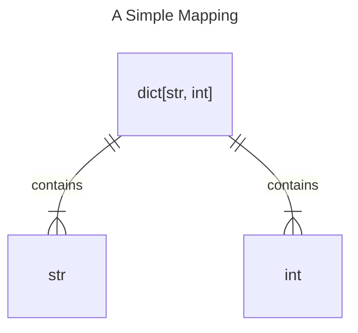
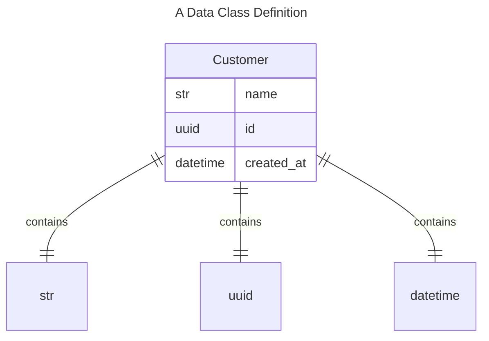
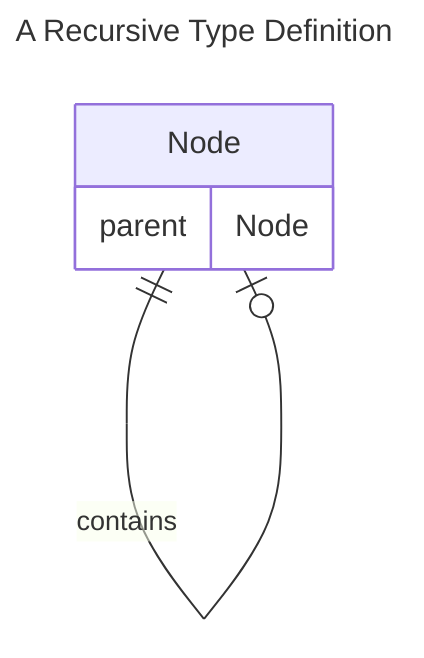
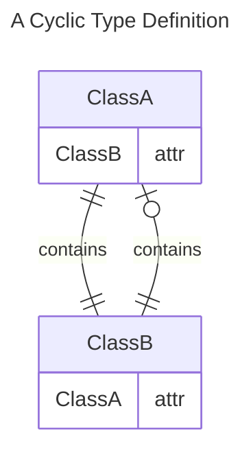

# Your Annotation is a Graph

Graph theory is a fundamental aspect of computer programming - nearly every problem can
be modeled as a graph and in most cases, doing so can drastically reduce the 
complexity of the solution. We use graph theory to map your type annotations into a
reliable resolution order for building out your marshalling and unmarshalling logic.

/// tip | Read More
- [Wikipedia - Graph Theory](https://en.wikipedia.org/wiki/Graph_theory){.external}
- [StackOverflow - Beginners Guide to Graph Theory](https://stackoverflow.blog/2022/05/26/the-complete-beginners-guide-to-graph-theory/){.external}
///

## Handling Data Models

Below we map out some examples of the type graph for some common annotations:

Given the above graph, the *static order* for resolving the type `dict[str, int]` 
would be: `(0: str, 1: int, 2: dict[str, int])`.

Given the above graph, the *static order* for resolving type `Customer` would be: 
`(0: str, 1: uuid, 2: datetime, 3: Customer)`.

Implementers can iterate over the static order, building a localized context for the 
type definition as we traverse from outer edges to the root node.

/// note
As an implementation detail, edge types will be resolved in the order they are declared 
within the containing type. However, we only guarantee that all edges will be provided 
before the containing type, the field-order of these edges is not guaranteed.
///

## Handling Cyclic Data Models

Graphs may have _cycles_ - if not addressed, this can result in infinite recursion. 
When we encounter a cyclic or direct recursive type, we wrap the cycle in a 
[`typing.ForwardRef`][] and terminate that branch. This provides another guarantee to 
implementations which leverage our graph resolver - _all forward references are cyclic 
types_ and should be delayed.

## Further Reading

- [API Reference][typelib.graph]
- [graphlib][]
